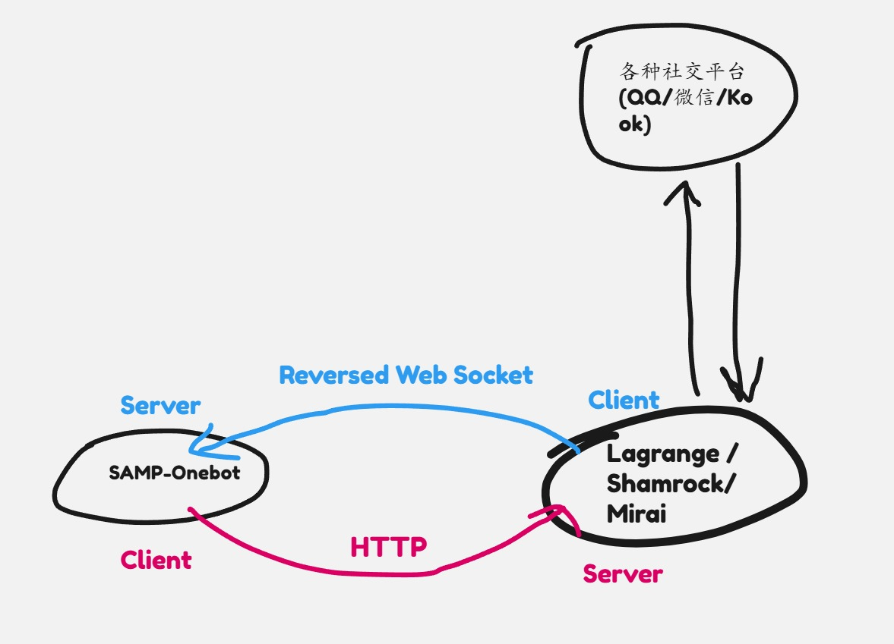

# Lagrange

Lagrange 是一个基于纯C#的NTQQ协议实现，支持Onebot

## 搭建Lagrange

### 下载

从 GitHub 上面下载 nightly release 

https://github.com/LagrangeDev/Lagrange.Core/tags

运行后提示

`No exist config file, create it now...`

`Please Edit the appsettings.json to set configs and press any key to continue`

首次运行的时候生成了 appsettings.json 文件这个时候按Ctrl+C 退出

### 配置

我们需要编辑lagrange的配置文 appsettings.json

appsettings.json:
```json
{
    "Logging": {
        "LogLevel": {
            "Default": "Information",
            "Microsoft": "Warning",
            "Microsoft.Hosting.Lifetime": "Information"
        }
    },
    "SignServerUrl": "",
    "SignProxyUrl": "",
    "MusicSignServerUrl": "",
    "Account": {
        "Uin": 0,
        "Password": "",
        "Protocol": "Linux",
        "AutoReconnect": true,
        "GetOptimumServer": true
    },
    "Message": {
        "IgnoreSelf": true,
        "StringPost": false
    },
    "QrCode": {
        "ConsoleCompatibilityMode": false
    },
    "Implementations": [
        {
            "Type": "ReverseWebSocket",
            "Host": "127.0.0.1",
            "Port": 8080,
            "Suffix": "",
            "ReconnectInterval": 5000,
            "HeartBeatInterval": 5000,
            "HeartBeatEnable": true,
            "AccessToken": ""
          },
          {
            "Type": "Http",
            "Host": "127.0.0.1",
            "Port": 8081,
            "AccessToken": ""
        }
    ]
}
```

其中Implementations是消息平台的通信方式，我们需要同时配置两种

1. ReverseWebSocket - Lagrange作为客户端通过反向WebSocket去连接SAMP-OneBot，此时SAMP-OneBot是作为服务器的角色
2. HTTP - Lagrange作为API的服务端，比如当我们需要发送群消息的时候，就需要调用API。此时SAMP-OneBot是作为客户端的角色

具体的通信方式见下图:



此外还有需要注意的设置:

1. Uin: QQ的账号
2. Password QQ密码
3. SignServerUrl：签名服务器的API(如果有必要)，用于处理腾讯签名算法

签名的API哪里获取？lagrange的tg服务器上面

注意 samp-onebot.json 中的端口和地址应与lagrange中一致:

samp-onebot.json:
```json
{
    "host": "127.0.0.1",
    "ws_port": 8080,
    "api_port": 8081,
    "thread_count": 6,
    "token": ""
}
```

### 登录

现在我们处理QQ登录的问题

lagrange使用扫码登录，登录的时候使用linux客户端的登录协议

运行后lagrange会在终端打印一个二维码，拿手机qq扫一下就好了

注意手机登录的qq得是和lagrange上配置的是一样的

