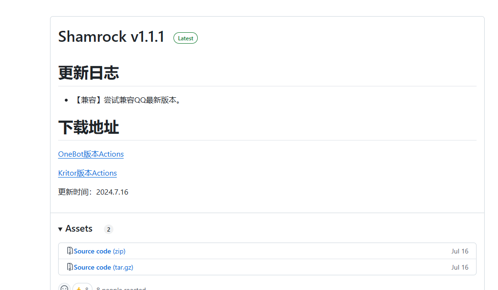

# Shamrock

`Shamrock 是一个基于 Xposed 实现 OneBot 标准的 QQ 机器人框架`

## 下载 Shamrock

首先你需要准备一台载有安卓系统的设备，可以是你自己的手机或者是安卓模拟器

然后从 Github 上下载 Onebot Action 版本的 Release: 

https://github.com/whitechi73/OpenShamrock/releases

下载apk后安装到手机上

## 配置

详细见： https://whitechi73.github.io/OpenShamrock/guide/getting-started.html

### 有 XP 环境
- 打开 QQ 客户端，登录你的 QQ 账号
- 安装 Shamrock 并在 Xposed 启用 Shamrock 模块，如果使用 LSPosed 则需要勾选模块作用域(默认QQ)
- 启动 Shamrock 并重新启动 QQ 客户端，如果环境为 Xposed 则需要重启手机
- 此时 Shamrock 会显示已激活(需要成功登陆，才会显示已激活)

### 无 Root 环境
#### 使用 LSPatch
- 打开 LSPatch 并在 管理 页面选择 + 新建修补，可以选择从存储目录选择 QQAPK 或者直接使用已经安装过的 QQ
修补模式默认且应该优先选择 本地模式 ，这样方便直接更新 Shamrock 模块而不用重新修补，缺点是需要 LSPatch 保持后台运行
- 其他配置保持默认，然后点击 开始修补 ，修补完成后会提示安装(如果已经安装会提示卸载)
- 安装 Shamrock 模块后在 管理 页面点击修补好的 QQ 选择 模块作用域 勾选上 Shamrock 模块然后保存
- 启动 Shamrock 并 重新启动 QQ 客户端
- 此时 Shamrock 会显示已激活

## 通信方式

1. ReverseWebSocket - Lagrange作为客户端通过反向WebSocket去连接SAMP-OneBot，此时SAMP-OneBot是作为服务器的角色
2. HTTP - Lagrange作为API的服务端，比如当我们需要发送群消息的时候，就需要调用API。此时SAMP-OneBot是作为客户端的角色

具体的通信方式见下图:

打开Shamrock，并修改HTTP和被动WebSocket的端口(在地址中),

需要与samp-onebot.json中的端口一致

被动WebSocket地址的格式是 ws://服务器地址:端口

（注：被动WebSocket指的就是反向WebSocket）

最后记得将被动WebSocket的开关打开

